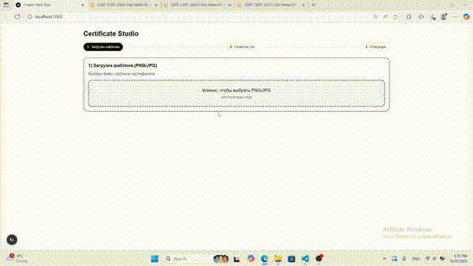
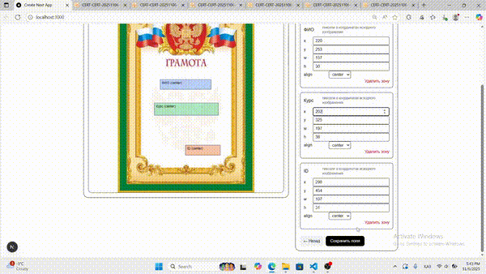

# Certic - Certificate Generator

Генератор сертификатов с настраиваемыми полями | Certificate generator with customizable fields



## Запуск | Setup
Для работы приложения необходимо указать параметры доступа к Vercel Blob Storage.
Создайте файл .env.local в корне проекта и добавьте туда следующие переменные:
BLOB_READ_WRITE_TOKEN=your-vercel-blob-token
BLOB_PUBLIC_BASE_URL=https://your-vercel-blob-url

```bash
npm install
npm run dev
```

## Template Field Setup

1. Upload your certificate template (PNG/JPG).
2. Use the mouse to draw rectangular areas for the fields:
   - Full Name
   - Course/Title
   - Certificate ID
3. For each field you can set alignment (left/center/right).

## Certificate Generation

### Single Generation
- Enter the recipient name.
- Enter course names separated by commas.
- Click "Generate".

### Batch Generation
Upload a CSV file with the following columns:
```csv
fio,courses
"John Doe","Course 1"
"Jane Doe","Course 2, Course 3"
```

## Generated Certificates

- Single certificates are returned inline as Data URLs.
- Batch certificates are packed into ZIP archives and returned as a Data URL.
- Nothing is persisted to disk: templates, fields, and outputs only live in memory.

### File Structure

- Generated filenames follow `CERT-{DATE}-{UUID}-{course}-{name}.png`.
